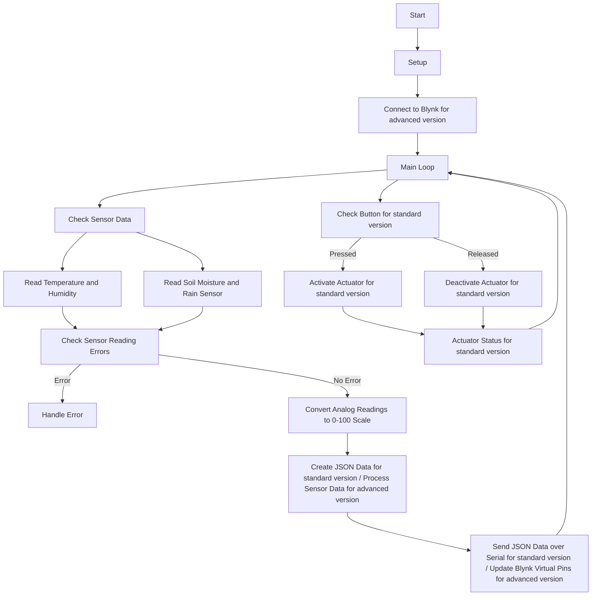

# Smart Irrigation System

This repository contains the code implementation for a smart irrigation system using an Arduino board and various sensors. The system automatically controls the actuator to water plants based on predefined conditions such as temperature, humidity, soil moisture, and rain sensor readings. It also allows manual watering through a push button and provides remote control using the Blynk IoT platform.

version:

- [standart](https://github.com/1999AZZAR/Smart-Irrigation-System/blob/master/code/standard/readme.md)
- [advance](https://github.com/1999AZZAR/Smart-Irrigation-System/blob/master/code/advance/readme.md)

translation:

- [indonesian](https://github.com/1999AZZAR/Smart-Irrigation-System/blob/master/readme_id.md)

# Table Of Contents

1. [Hardware Requirements](#Hardware-Requirements)
2. [Software Dependencies](#Software-Dependencies)
3. [Pin Configuration](#Pin-Configuration)
4. [Functionality](#Functionality)
5. [Usage](#Usage)
6. [Flowchart](#Flowchart)
7. [UML diagrams](#UML-diagrams)
8. [Troubleshooting](#Troubleshooting)
9. [Customization](#Customization)
10. [Note](#Note)
11. [License](#License)
12. [pictures](https://github.com/1999AZZAR/Smart-Irrigation-System/tree/master/pic#readme)

## Hardware Requirements

To build and run the smart irrigation system, you will need the following hardware components:

- Arduino board
- DHT11 temperature and humidity sensor
- Soil moisture sensor
- Rain sensor
- Relay module (for standard version)
- Dual relay module (for advanced version)
- Push button (for standard version)
- ESP8266-based board (e.g., NodeMCU) (for advanced version)
- Jumper wires
- Breadboard (optional)

## Software Dependencies

The code relies on the following libraries. Make sure they are installed in your Arduino IDE before uploading the code to the Arduino board:

- DHT library: This library provides functions to read temperature and humidity from the DHT11 sensor.
- Blynk library (for advanced version)
- ArduinoJson library (for advanced version)

## Pin Configuration

For the standard version, make the following connections:

- DHT11 sensor: Connect the sensor data pin to digital pin 2 (DHTPIN).
- Soil moisture sensor: Connect the sensor output pin to analog pin A0 (soilMoisturePin).
- Rain sensor: Connect the sensor output pin to analog pin A1 (rainSensorPin).
- Relay module: Connect the relay control pin to digital pin 9 (relayPin).
- Push button: Connect one end of the button to digital pin 3 (buttonPin), and the other end to ground.

For the advanced version, make the following connections:

- DHT11 sensor: Connect the sensor data pin to digital pin 2 (DHTPIN).
- Soil moisture sensor: Connect the sensor output pin to analog pin A0 (soilMoisturePin).
- Rain sensor: Connect the sensor output pin to analog pin A1 (rainSensorPin).
- Dual relay module: Connect the relay control pins to digital pins 9 and 10 (relay1Pin, relay2Pin).
- ESP8266-based board: Connect the board to your computer using a USB cable.

Please ensure that you have made the necessary hardware connections before running the code.

## Functionality

The code provides the following functionality:

### Setup

- Initializes the serial communication at a baud rate of 9600.
- Configures the relay pin(s) and button pin (for standard version) as output and input, respectively.
- Begins communication with the DHT11 sensor.
- Connects to the Blynk server (for advanced version).

### Main Loop

- Checks the state of the push button (for standard version) using the `checkButton()` function.
- Checks the sensor data at regular intervals using the `checkSensors()` function.

### Sensor Data Checking

- Reads temperature, humidity, soil moisture, and rain sensor values.
- Checks for any errors in reading the sensor data.
- Creates a JSON string containing the sensor readings and sends it over the serial port (for standard version).
- Sends the sensor data to the Blynk server (for advanced version).
- Calls the `checkWateringConditions()` function to determine if the actuator should be activated or deactivated.

### Push Button Checking (for standard version)

- Reads the state of the push button.
- If the button is pressed and manual watering is not active, activates the actuator.
- If the button is released and manual watering is active, deactivates the actuator.

### Watering Conditions Checking

- If manual watering is active, bypasses the conditions and keeps the actuator activated.
- Otherwise, checks the following conditions:
  - If the soil moisture is below 40 and no rain is detected, activates the actuator.
  - If the humidity is below 50 and the temperature is above 30, activates the actuator.
  - If the soil moisture is equal to or above 75 or rain is detected, deactivates the actuator.

### Actuator Control

- Activates the actuator by setting the relay pin(s) to HIGH (for standard version).
- Deactivates the actuator by setting the relay pin(s) to LOW (for standard version).
- Controls the actuator using virtual pin V4 on the Blynk app (for advanced version).
- Sends a message over the serial port (for standard version) or to the Blynk app (for advanced version) indicating the activation or deactivation of the actuator.

## Usage

Follow these steps to use the smart irrigation system:

1. Make the necessary hardware connections as described in the "Pin Configuration" section.
2. Install the required libraries in your Arduino IDE.
3. Upload the code to your Arduino board.
4. Open the serial monitor in the Arduino IDE to view the sensor data and actuator status (for standard version).
5. Set up the necessary widgets in the Blynk app and obtain the Blynk authorization token (for advanced version).
6. Replace the placeholders in the sketch with your actual information (for advanced version).
7. Upload the sketch to the ESP8266 board (for advanced version).
8. Power on the board and ensure it is connected to the Wi-Fi network (for advanced version).
9. Open the Blynk mobile app and navigate to your project (for advanced version).
10. Sensor data will be displayed on the corresponding virtual pins (V0 to V3) (for advanced version).
11. Use virtual pin V4 on the Blynk app to control the actuator (relay) remotely (for advanced version).

Make sure that the Arduino board (for standard version) or ESP8266 board (for advanced version) is properly powered and connected to your computer.

## Flowchart

The flowchart below illustrates the logic of the smart irrigation system:



## UML diagrams

```mermaid
sequenceDiagram
    autonumber
    participant A as "Start"
    participant B as "Setup"
    participant C as "Blynk"
    participant D as "Main Loop"
    participant E as "Button"
    participant F as "Sensor Data"
    participant G as "Temperature and Humidity Sensor"
    participant H as "Soil Moisture and Rain Sensor"
    participant I as "Error Handling"
    participant J as "Handle Error"
    participant K as "Analog Readings Conversion"
    participant L as "Data Processing"
    participant M as "Serial Communication / Blynk Update"
    participant N as "Actuator Activation"
    participant O as "Actuator Deactivation"
    participant P as "Actuator Status"

    A ->> B: "Setup"
    B ->> C: "Connect to Blynk for advanced version"
    C ->> D: "Main Loop"
    D ->> E: "Check Button for standard version"
    D ->> F: "Check Sensor Data"
    F ->> G: "Read Temperature and Humidity"
    G ->> I: "Check Sensor Reading Errors"
    I -- Error --> J: "Handle Error"
    I -- No Error --> K: "Convert Analog Readings to 0-100 Scale"
    K ->> L: "Create JSON Data for standard version / Process Sensor Data for advanced version"
    L ->> M: "Send JSON Data over Serial for standard version / Update Blynk Virtual Pins for advanced version"
    M ->> D: "Main Loop"
    F ->> H: "Read Soil Moisture and Rain Sensor"
    H ->> I: "Check Sensor Reading Errors"
    E -- Pressed --> N: "Activate Actuator for standard version"
    E -- Released --> O: "Deactivate Actuator for standard version"
    N ->> P: "Actuator Status for standard version"
    O ->> P: "Actuator Status for standard version"
    P ->> D: "Main Loop"
```

## Troubleshooting

If you encounter any issues while using the smart irrigation system, consider the following troubleshooting steps:

- If you encounter errors while reading the sensor data, check the connections and ensure that the sensors are functioning correctly.
- If the actuator is not activating or deactivating as expected (for standard version), verify the relay module's connections and ensure that it is compatible with the actuator.
- For troubleshooting the advanced version, refer to the Blynk documentation and community resources.

## Customization

You can customize the watering conditions by modifying the logic in the `checkWateringConditions()` function. Adjust the threshold values and conditions according to your specific requirements.

You can also modify the pin assignments and sensor types by changing the corresponding constants at the beginning of the code.

For the advanced version, you can modify the virtual pins and widgets in the Blynk app to match your project setup. Replace the relay control functions with your own implementation if needed. Extend the sketch to include additional sensors or actuators as needed.

## Note

This code assumes the use of a DHT11 sensor for temperature and humidity, and analog sensors for soil moisture and rain detection (for standard version). If you are using different sensors, make sure to modify the code accordingly and use the appropriate libraries and pin configurations.

This code is provided as a starting point and may require modifications and enhancements to suit your specific application and environment.

## License

This code is released under the

 [MIT License](https://opensource.org/licenses/MIT). Feel free to modify and use it for your projects.
