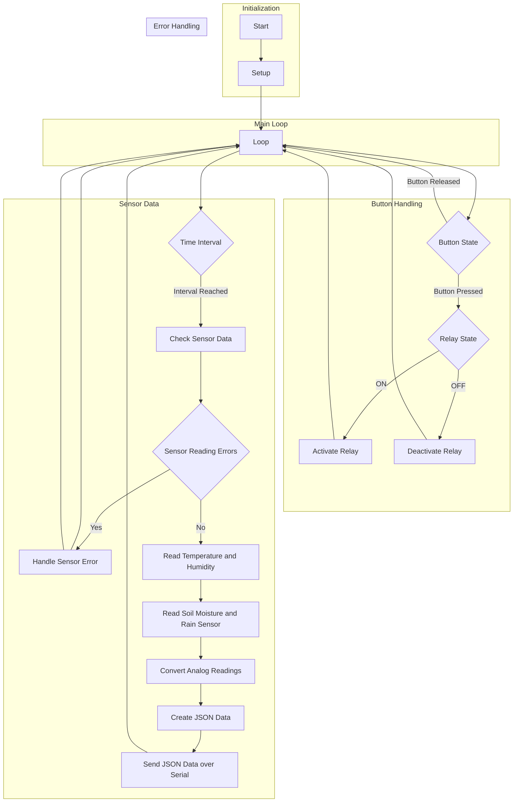

# Code1

This Arduino project allows you to control a dual relay module using three sensors (soil moisture, rain sensor, and DHT11) and one button input. The code is designed to run on an Arduino Uno and incorporates the necessary libraries and principles to ensure reliability and efficiency.

translation:
- [indonesian](https://github.com/1999AZZAR/Smart-Irrigation-System/blob/master/code/advance/code1/readme_id.md)

## Prerequisites

To run this code, you will need the following components:

- Arduino Uno board
- Dual relay module
- Capacitive soil moisture sensor
- Analog rain sensor (resistance-based)
- DHT11 temperature and humidity sensor
- Push button
- Jumper wires
- Breadboard (optional)

Ensure that you have the required hardware components properly connected to the Arduino Uno board before uploading the code.

## Installation

1. Connect the soil moisture sensor to analog pin A0 on the Arduino board.
2. Connect the rain sensor to analog pin A1 on the Arduino board.
3. Connect the DHT11 sensor to digital pin 5 on the Arduino board.
4. Connect the button to digital pin 2 on the Arduino board.
5. Connect the relay module to digital pins 3 and 4 on the Arduino board.
6. Make sure you have the necessary libraries installed:
   - DHT sensor library (for the DHT11 sensor)
   - ArduinoJson library (for creating JSON data)

## Usage

1. Open the Arduino IDE on your computer.
2. Connect the Arduino Uno board to your computer using a USB cable.
3. Open the Arduino code file (`sensor_actuator_control.ino`) in the Arduino IDE.
4. Click on the "Upload" button to upload the code to the Arduino board.
5. Open the serial monitor to view the sensor data.

The program will continuously monitor the sensors and update the relay module's state based on the button input. The sensor readings for temperature, humidity, soil moisture, and rain will be sent over the serial communication in JSON format.

## Flowchart

## Customization

You can customize the code to fit your specific requirements:

- Adjust the pin mappings in the code if you connect the sensors or relay module to different pins.
- Modify the error handling mechanism in the `handleSensorError()` function to suit your needs.
- Extend the code to include additional functionality or control other actuators based on the sensor readings.

## Contributing

Contributions to this project are welcome. If you have any suggestions, improvements, or bug fixes, please submit a pull request or open an issue on the GitHub repository.

## License

This project is licensed under the [MIT License](LICENSE). Feel free to use, modify, and distribute the code for personal or commercial purposes.

## Acknowledgments

- The code makes use of the following libraries:
  - DHT sensor library: [https://github.com/adafruit/DHT-sensor-library](https://github.com/adafruit/DHT-sensor-library)
  - ArduinoJson library: [https://arduinojson.org/](https://arduinojson.org/)
