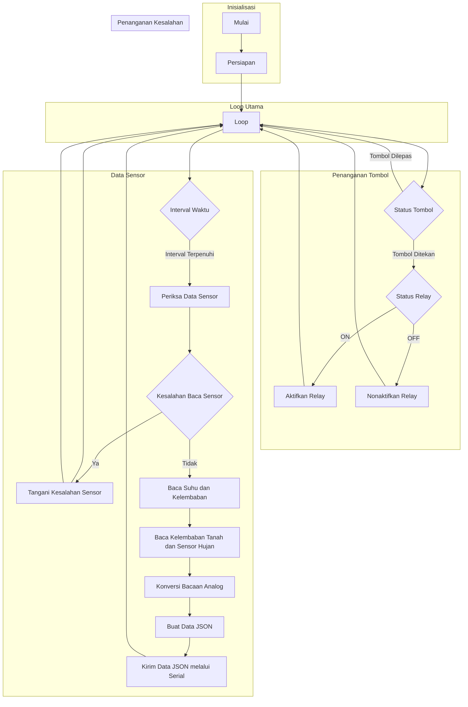

# Kode1

Proyek Arduino ini memungkinkan Anda untuk mengendalikan modul relay ganda menggunakan tiga sensor (sensor kelembapan tanah, sensor hujan, dan DHT11) dan satu input tombol. Kode ini dirancang untuk dijalankan pada papan Arduino Uno dan mencakup perpustakaan dan prinsip-prinsip yang diperlukan untuk memastikan keandalan dan efisiensi.

## Persyaratan

Untuk menjalankan kode ini, Anda akan membutuhkan komponen-komponen berikut:

- Papan Arduino Uno
- Modul relay ganda
- Sensor kelembapan tanah kapasitif
- Sensor hujan analog (berbasis resistansi)
- Sensor suhu dan kelembaban DHT11
- Tombol tekan
- Kabel jumper
- Breadboard (opsional)

Pastikan komponen perangkat keras yang diperlukan terhubung dengan benar ke papan Arduino Uno sebelum mengunggah kode.

## Instalasi

1. Hubungkan sensor kelembapan tanah ke pin analog A0 pada papan Arduino.
2. Hubungkan sensor hujan ke pin analog A1 pada papan Arduino.
3. Hubungkan sensor DHT11 ke pin digital 5 pada papan Arduino.
4. Hubungkan tombol ke pin digital 2 pada papan Arduino.
5. Hubungkan modul relay ke pin digital 3 dan 4 pada papan Arduino.
6. Pastikan Anda telah menginstal perpustakaan yang diperlukan:
   - Perpustakaan sensor DHT (untuk sensor DHT11)
   - Perpustakaan ArduinoJson (untuk membuat data JSON)

## Penggunaan

1. Buka Arduino IDE di komputer Anda.
2. Hubungkan papan Arduino Uno ke komputer Anda menggunakan kabel USB.
3. Buka file kode Arduino (`sensor_actuator_control.ino`) di Arduino IDE.
4. Klik tombol "Upload" untuk mengunggah kode ke papan Arduino.
5. Buka serial monitor untuk melihat data sensor.

Program akan terus memantau sensor dan memperbarui status modul relay berdasarkan masukan tombol. Pembacaan sensor untuk suhu, kelembaban, kelembapan tanah, dan hujan akan dikirim melalui komunikasi serial dalam format JSON.

## Diagram Alir

## Penyesuaian

Anda dapat menyesuaikan kode sesuai dengan persyaratan spesifik Anda:

- Sesuaikan penugasan pin dalam kode jika Anda menghubungkan sensor atau modul relay ke pin yang berbeda.
- Modifikasi mekanisme penanganan kesalahan pada fungsi `handleSensorError()` sesuai dengan kebutuhan Anda.
- Perluas kode untuk menyertakan fungsionalitas tambahan atau mengendalikan aktuator lain berdasarkan pembacaan sensor.

## Berkontribusi

Kontribusi terhadap proyek ini sangat diterima. Jika Anda memiliki saran, perbaikan, atau pemecahan masalah, silakan kirim pull request atau buka isu di repositori GitHub.

## Lisensi

Proyek ini dilisensikan di bawah [Lisensi MIT](LICENSE). Silakan gunakan, modifikasi, dan distribusikan kode ini untuk tujuan pribadi atau komersial.

## Pengakuan

- Kode ini menggunakan perpustakaan-perpustakaan berikut:
  - Perpustakaan sensor DHT: [https://github.com/adafruit/DHT-sensor-library](https://github.com/adafruit/DHT-sensor-library)
  - Perpustakaan ArduinoJson: [https://arduinojson.org/](https://arduinojson.org/)
