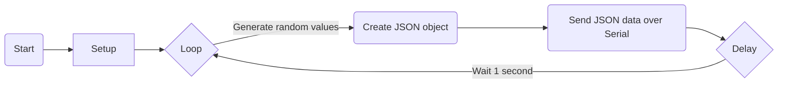

## Simulation

This is a simple Arduino sketch that generates random sensor data and sends it as JSON-formatted output over the serial port. The code utilizes the ArduinoJson library to create JSON objects and the Serial library to send the data.

translation:

- [indonesian](https://github.com/1999AZZAR/Smart-Irrigation-System/blob/master/code/advance/code1/simulation/readme_id.md)

### Hardware Requirements

- Arduino Uno or compatible board
- USB cable to connect the Arduino board to your computer

### Software Requirements

- Arduino IDE (Integrated Development Environment) installed on your computer
- ArduinoJson library installed in the Arduino IDE

### Installation and Setup

1. Connect your Arduino Uno board to your computer using a USB cable.
2. Launch the Arduino IDE software on your computer.
3. Install the ArduinoJson library if you haven't already. To install the library, go to **Tools** > **Manage Libraries** in the Arduino IDE, search for "ArduinoJson", select the latest version, and click on the **Install** button.
4. Create a new sketch in the Arduino IDE.
5. Copy the provided code and paste it into the new sketch.
6. Verify that the code compiles without any errors by clicking on the "Verify" button (checkmark icon) in the Arduino IDE.
7. Upload the code to your Arduino Uno board by clicking on the "Upload" button (right arrow icon) in the Arduino IDE.

### Usage

1. After successfully uploading the code to the Arduino Uno board, open the serial monitor in the Arduino IDE by clicking on the "Serial Monitor" button (magnifying glass icon) or by pressing Ctrl+Shift+M.
2. Set the baud rate of the serial monitor to 9600.
3. The sketch will start generating random sensor data, including temperature, humidity, soil moisture, and rain sensor readings.
4. The generated sensor data will be sent as JSON objects over the serial port. Each JSON object represents a single reading and contains the following keys:
   - "temperature": A random float value between 0 and 100, representing temperature.
   - "humidity": A random float value between 0 and 100, representing humidity.
   - "soil_moisture": A random integer value between 0 and 100, representing soil moisture.
   - "rain_sensor": A random integer value between 0 and 100, representing the rain sensor reading.
5. The JSON objects will be displayed in the serial monitor as they are sent over the serial port. Each object will be followed by a newline character to separate the readings.
6. The sketch will continue generating and sending new sensor data in a loop with a delay of 1 second between each reading.

### Flowchart

### Customization

- You can modify the range of the random values generated by changing the arguments of the `random()` function. Adjust the minimum and maximum values to suit your specific needs.
- If you want to change the baud rate for the serial communication, modify the value passed to the `Serial.begin()` function in the `setup()` function.

### Note

- This code is for educational and testing purposes only. The generated random sensor data does not represent actual sensor readings.
- Make sure to disconnect any actual sensors connected to the analog pins mentioned in the code to avoid conflicts or incorrect readings.

### License

This code is provided under the MIT License. Feel free to modify and distribute it as needed, but please refer to the original license file for more details.

For additional information or questions, please refer to the official Arduino documentation or visit the Arduino forums and community resources.
