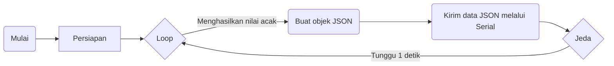

## Simulasi

Ini adalah sketsa Arduino sederhana yang menghasilkan data sensor acak dan mengirimkannya melalui port serial dalam format JSON. Kode ini menggunakan perpustakaan ArduinoJson untuk membuat objek JSON dan perpustakaan Serial untuk mengirimkan data.

### Persyaratan Hardware

- Arduino Uno atau board yang kompatibel
- Kabel USB untuk menghubungkan board Arduino ke komputer Anda

### Persyaratan Software

- Arduino IDE (Integrated Development Environment) terpasang di komputer Anda
- Perpustakaan ArduinoJson terpasang di Arduino IDE

### Instalasi dan Pengaturan

1. Hubungkan board Arduino Uno Anda ke komputer menggunakan kabel USB.
2. Buka perangkat lunak Arduino IDE di komputer Anda.
3. Jika belum terpasang, pasang perpustakaan ArduinoJson. Untuk memasang perpustakaan, pergi ke **Tools** > **Manage Libraries** dalam Arduino IDE, cari "ArduinoJson", pilih versi terbaru, dan klik tombol **Install**.
4. Buat sketsa baru di Arduino IDE.
5. Salin kode yang disediakan dan tempelkan ke sketsa baru tersebut.
6. Verifikasi bahwa kode dikompilasi tanpa ada kesalahan dengan mengklik tombol "Verify" (tanda centang) di Arduino IDE.
7. Unggah kode ke board Arduino Uno Anda dengan mengklik tombol "Upload" (ikon panah kanan) di Arduino IDE.

### Penggunaan

1. Setelah berhasil mengunggah kode ke board Arduino Uno, buka serial monitor di Arduino IDE dengan mengklik tombol "Serial Monitor" (ikon kaca pembesar) atau dengan menekan Ctrl+Shift+M.
2. Atur baud rate serial monitor menjadi 9600.
3. Sketsa akan mulai menghasilkan data sensor acak, termasuk suhu, kelembaban, kelembaban tanah, dan pembacaan sensor hujan.
4. Data sensor yang dihasilkan akan dikirimkan sebagai objek JSON melalui port serial. Setiap objek JSON mewakili satu pembacaan dan berisi kunci-kunci berikut:
   - "temperature": Nilai float acak antara 0 dan 100, mewakili suhu.
   - "humidity": Nilai float acak antara 0 dan 100, mewakili kelembaban.
   - "soil_moisture": Nilai integer acak antara 0 dan 100, mewakili kelembaban tanah.
   - "rain_sensor": Nilai integer acak antara 0 dan 100, mewakili pembacaan sensor hujan.
5. Objek JSON akan ditampilkan di serial monitor saat dikirimkan melalui port serial. Setiap objek akan diikuti oleh karakter newline untuk memisahkan pembacaan.
6. Sketsa akan terus menghasilkan dan mengirimkan data sensor baru dalam loop dengan jeda 1 detik antara setiap pembacaan.

### Diagram Alir

### Kustomisasi

- Anda dapat mengubah rentang nilai acak yang dihasilkan dengan mengubah argumen fungsi `random()`. Sesuaikan nilai minimum dan maksimum sesuai kebutuhan Anda.
- Jika Anda ingin mengubah baud rate untuk komunikasi serial, ubah nilai yang diberikan kepada fungsi `Serial.begin()` dalam fungsi `setup()`.

### Catatan

- Kode ini hanya untuk tujuan pendidikan dan pengujian. Data sensor acak yang dihasilkan tidak mewakili pembacaan sensor sebenarnya.
- Pastikan untuk memutuskan koneksi sensor fisik yang terhubung ke pin analog yang disebutkan dalam kode untuk menghindari konflik atau pembacaan yang tidak benar.

### Lisensi

Kode ini disediakan di bawah Lisensi MIT. Silakan modifikasi dan distribusikan sesuai kebutuhan, tetapi harap merujuk ke file lisensi asli untuk informasi lebih lanjut.

Untuk informasi tambahan atau pertanyaan, silakan merujuk ke dokumentasi resmi Arduino atau kunjungi forum Arduino dan sumber daya komunitas.
