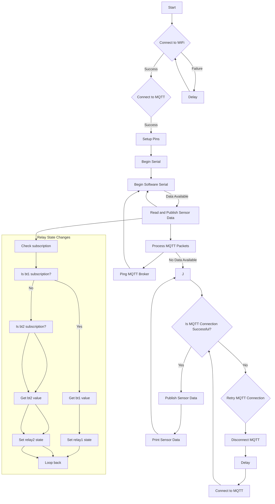

# code2_adafruit

This code implements an MQTT-based irrigation system using an ESP8266 microcontroller. The system collects sensor data from various sources and publishes it to Adafruit IO, an MQTT broker. Additionally, it subscribes to MQTT topics to receive commands for controlling relays.

## Prerequisites
To use this code, you will need the following:

- Arduino IDE with ESP8266 board support
- ESP8266WiFi library
- SoftwareSerial library
- Adafruit MQTT library
- ArduinoJson library

## Installation and Configuration
1. Install the necessary libraries listed above.
2. Replace the placeholders in the code with your specific configuration:
   - `YOUR_AIO_USERNAME` with your Adafruit IO username.
   - `YOUR_AIO_KEY` with your Adafruit IO key.
   - `YOUR_SSID` with the name of your Wi-Fi network.
   - `SSID_PASSWORD` with the password for your Wi-Fi network.
3. Connect the ESP8266 microcontroller to the appropriate pins for relay control (pin numbers specified in the `RELAY_PIN` array).
4. Upload the code to your ESP8266 using the Arduino IDE.
5. Open the serial monitor to monitor the system's output.

## Usage
1. The ESP8266 connects to the specified Wi-Fi network upon startup.
2. It then establishes a connection to the Adafruit IO MQTT broker using the provided credentials.
3. The ESP8266 listens for data from a sensor through a software serial connection and publishes it to Adafruit IO by deserializing the JSON data.
4. The sensor data is published to the respective MQTT topics: `irrigation.temperature`, `irrigation.humidity`, `irrigation.soilMoisture`, and `irrigation.rainSensor`.
5. The ESP8266 periodically sends MQTT keep-alive packets to maintain the connection with the broker.
6. The ESP8266 listens for MQTT messages related to relay control, specifically on topics `irrigation.relay1` and `irrigation.relay2`.
7. Upon receiving messages on these topics, the ESP8266 toggles the specified relays accordingly.

## Flowchart

## Customization
- You can modify the pins used for relay control by changing the values in the `RELAY_PIN` array.
- To add or modify the sensor data being published, adjust the JSON deserialization in the `deserializeAndPublish` function and the respective MQTT topic declarations.
- Additional sensors or actuators can be integrated by expanding the code logic accordingly.

## Troubleshooting
- If you encounter connection issues, ensure that your Wi-Fi network credentials and Adafruit IO MQTT credentials are correct.
- Check the wiring of your ESP8266 and relays to ensure they are properly connected.
- Verify that the MQTT topics and data formats match your desired setup.

## License
This code is released under the [MIT License](https://opensource.org/licenses/MIT). Feel free to modify and distribute it according to your needs.

## Acknowledgments
- This code was developed based on the Adafruit MQTT library examples and ESP8266 platform documentation.
