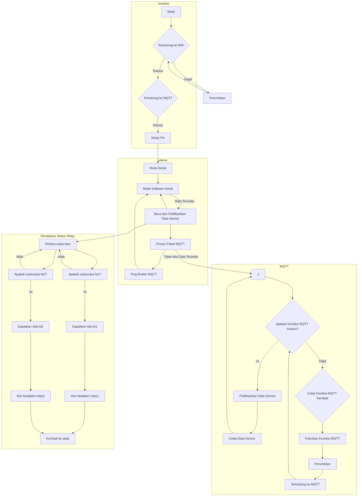

# code2_adafruit

Kode ini mengimplementasikan sistem irigasi berbasis MQTT menggunakan mikrokontroler ESP8266. Sistem ini mengumpulkan data sensor dari berbagai sumber dan mempublikasikannya ke Adafruit IO, sebuah broker MQTT. Selain itu, sistem juga melakukan subscribe ke topik-topik MQTT untuk menerima perintah kontrol relay.

## Persyaratan
Untuk menggunakan kode ini, Anda akan membutuhkan hal-hal berikut:

- Arduino IDE dengan dukungan board ESP8266
- Perpustakaan ESP8266WiFi
- Perpustakaan SoftwareSerial
- Perpustakaan MQTT Adafruit
- Perpustakaan ArduinoJson

## Instalasi dan Konfigurasi
1. Pasang perpustakaan yang diperlukan yang tercantum di atas.
2. Gantikan tempat-tempat kosong dalam kode dengan konfigurasi spesifik Anda:
   - `YOUR_AIO_USERNAME` dengan username Adafruit IO Anda.
   - `YOUR_AIO_KEY` dengan kunci Adafruit IO Anda.
   - `YOUR_SSID` dengan nama jaringan Wi-Fi Anda.
   - `SSID_PASSWORD` dengan kata sandi jaringan Wi-Fi Anda.
3. Hubungkan mikrokontroler ESP8266 ke pin yang sesuai untuk kontrol relay (nomor pin dijelaskan dalam array `RELAY_PIN`).
4. Unggah kode ke ESP8266 menggunakan Arduino IDE.
5. Buka serial monitor untuk memantau keluaran sistem.

## Penggunaan
1. ESP8266 terhubung ke jaringan Wi-Fi yang ditentukan saat diaktifkan.
2. Kemudian, ESP8266 membangun koneksi ke broker MQTT Adafruit IO menggunakan kredensial yang diberikan.
3. ESP8266 mendengarkan data dari sensor melalui koneksi serial perangkat lunak dan mempublikasikannya ke Adafruit IO dengan melakukan deserialisasi data JSON.
4. Data sensor dipublikasikan ke topik-topik MQTT yang sesuai: `irrigation.temperature`, `irrigation.humidity`, `irrigation.soilMoisture`, dan `irrigation.rainSensor`.
5. ESP8266 secara periodik mengirimkan paket keep-alive MQTT untuk mempertahankan koneksi dengan broker.
6. ESP8266 mendengarkan pesan-pesan MQTT terkait kontrol relay, khususnya pada topik `irrigation.relay1` dan `irrigation.relay2`.
7. Setelah menerima pesan pada topik-topik tersebut, ESP8266 mengubah keadaan relay yang ditentukan.

## Diagram Alur

## Penyesuaian
- Anda dapat mengubah pin yang digunakan untuk kontrol relay dengan mengubah nilai dalam array `RELAY_PIN`.
- Untuk menambahkan atau mengubah data sensor yang dipublikasikan, sesuaikan deserialisasi JSON dalam fungsi `deserializeAndPublish` dan deklarasi topik MQTT yang sesuai.
- Sensor atau aktuator tambahan dapat diintegrasikan dengan memperluas logika kode secara tepat.

## Troubleshooting
- Jika Anda mengalami masalah koneksi, pastikan kredensial jaringan Wi-Fi dan kredensial MQTT Adafruit IO Anda benar.
- Periksa pengkabelan ESP8266 dan relay Anda untuk memastikan bahwa mereka terhubung dengan benar.
- Verifikasi bahwa topik-topik MQTT dan format data sesuai dengan setup yang diinginkan.

## Lisensi
Kode ini dirilis di bawah [Lisensi MIT](https://opensource.org/licenses/MIT). Anda bebas untuk memodifikasi dan mendistribusikannya sesuai dengan kebutuhan Anda.

## Pengakuan
- Kode ini dikembangkan berdasarkan contoh-contoh perpustakaan MQTT Adafruit dan dokumentasi platform ESP8266.
  
