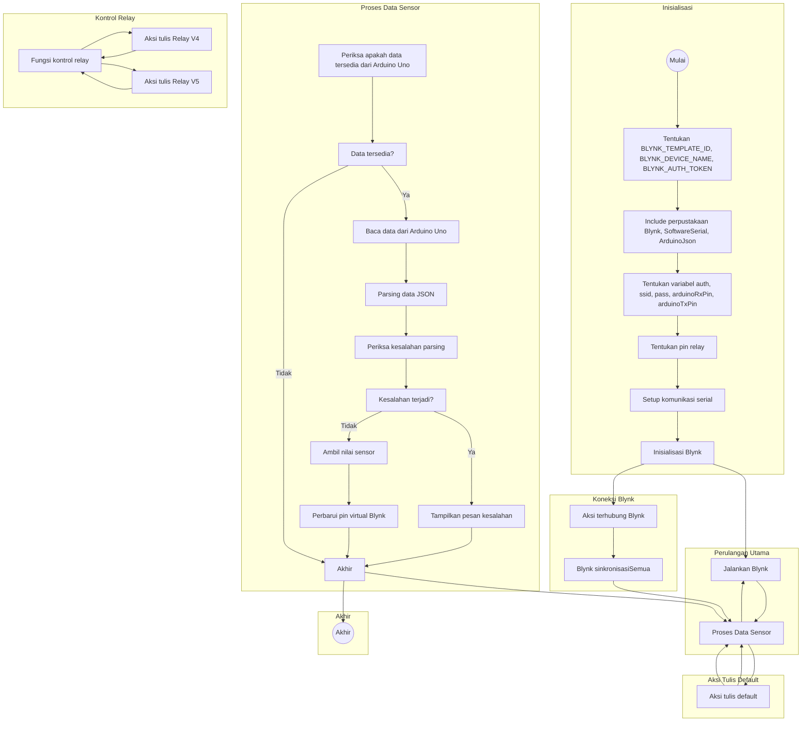

# Kode2

Proyek ini memungkinkan Anda untuk memantau data sensor dari Arduino Uno menggunakan papan ESP8266 dan menampilkan data tersebut pada aplikasi mobile Blynk. Papan ESP8266 berfungsi sebagai jembatan antara Arduino Uno dan server Blynk, memungkinkan komunikasi nirkabel.

Kode yang disediakan membuat koneksi dengan server Blynk, membaca data JSON yang dikirim oleh Arduino Uno, dan memperbarui nilai-nilai sensor pada aplikasi Blynk. Kode ini juga mencakup fungsi kontrol relay untuk mengendalikan perangkat eksternal berdasarkan masukan aplikasi Blynk.

## Persyaratan

Untuk menggunakan kode ini, Anda memerlukan komponen-komponen berikut:

- Papan ESP8266 (misalnya, NodeMCU)
- Arduino Uno
- Sensor yang kompatibel dengan Arduino Uno (misalnya, suhu, kelembaban, kelembapan tanah, sensor hujan)
- Aplikasi mobile Blynk (tersedia untuk iOS dan Android)
- Arduino IDE

## Penyambungan Kabel

Hubungkan ESP8266 dan Arduino Uno sebagai berikut:

- Pin Tx ESP8266 (GPIO2) ke pin Rx Arduino Uno
- Pin Rx ESP8266 (GPIO3) ke pin Tx Arduino Uno
- Ground ESP8266 ke ground Arduino Uno
- Hubungkan sensor ke pin yang sesuai pada Arduino Uno

## Instalasi

1. Instal Arduino IDE dari situs web resmi: https://www.arduino.cc/en/software

2. Buka Arduino IDE dan instal perpustakaan yang diperlukan:

   - Perpustakaan Blynk: Sketch -> Include Library -> Manage Libraries. Cari "Blynk" dan klik tombol "Install".
   - Perpustakaan ArduinoJson: Sketch -> Include Library -> Manage Libraries. Cari "ArduinoJson" dan klik tombol "Install".
   - Perpustakaan SoftwareSerial: Sketch -> Include Library -> Manage Libraries. Cari "SoftwareSerial" dan klik tombol "Install".

3. Unduh atau salin kode yang disediakan ke dalam sketsa baru di Arduino IDE.

4. Modifikasi kode:

   - Ganti `<your_template_id>` dengan ID template Blynk Anda.
   - Ganti `<your_device_name>` dengan nama perangkat yang diinginkan.
   - Ganti `<your_auth_token>` dengan token otentikasi Blynk Anda.
   - Ganti `<your_wifi_ssid>` dengan nama jaringan Wi-Fi Anda (SSID).
   - Ganti `<your_wifi_password>` dengan kata sandi jaringan Wi-Fi Anda.

5. Unggah kode ke papan ESP8266 dengan memilih tipe papan dan port di Arduino IDE, lalu klik tombol "Upload".

6. Buka aplikasi mobile Blynk, buat proyek baru, dan hubungkannya dengan ID template yang telah Anda tentukan sebelumnya.

7. Tambahkan widget yang diperlukan ke proyek Blynk untuk menampilkan data sensor dan mengendalikan relay (jika diperlukan).

8. Jalankan proyek Blynk di perangkat mobile Anda.

9. Nyalakan Arduino Uno dan papan ESP8266.

10. Anda akan melihat data sensor ditampilkan pada aplikasi Blynk, dan Anda dapat mengendalikan relay melalui widget yang sesuai.

## Peng

gunaan

1. Buat proyek baru di aplikasi mobile Blynk.
2. Siapkan widget yang diperlukan di aplikasi Blynk:
   - Pin virtual V0: Tampilan suhu
   - Pin virtual V1: Tampilan kelembaban
   - Pin virtual V2: Tampilan kelembapan tanah
   - Pin virtual V3: Tampilan hujan
   - Pin virtual V4: Kontrol tombol/aktuator
3. Dapatkan token otentikasi Blynk untuk proyek Anda.
4. Ganti tanda `<your_template_id>`, `<your_device_name>`, `<your_auth_token>`, `<your_wifi_ssid>`, dan `<your_wifi_password>` pada sketsa dengan informasi Anda yang sebenarnya.
5. Unggah sketsa ke papan ESP8266.
6. Nyalakan papan dan pastikan terhubung ke jaringan Wi-Fi.
7. Buka aplikasi mobile Blynk, masuk, dan buka proyek Anda.
8. Data sensor akan ditampilkan pada pin virtual yang sesuai (V0 hingga V3).
9. Gunakan pin virtual V4 di aplikasi Blynk untuk mengendalikan aktuator (relay).

## Alir Program

## Penyesuaian

Anda dapat menyesuaikan sketsa sesuai dengan kebutuhan spesifik Anda:

- Modifikasi pin virtual dan widget yang sesuai di aplikasi Blynk untuk mencocokkan setup proyek Anda.
- Perluas sketsa untuk memasukkan sensor atau aktuator tambahan berdasarkan kebutuhan proyek Anda.
- Jika Anda memiliki penugasan pin yang berbeda untuk modul relay, modifikasi larik `RELAY_PIN` dalam kode untuk mencocokkan konfigurasi Anda.
- Sesuaikan kecepatan baud dalam kode (`9600` secara default) jika Arduino Uno Anda menggunakan kecepatan baud yang berbeda.

## Mengatasi Masalah

Jika Anda menghadapi masalah atau kesalahan saat menjalankan kode, pastikan untuk memeriksa hal-hal berikut:

- Pastikan bahwa BLYNK_TEMPLATE_ID, device name, dan authentication token Blynk dikonfigurasi dengan benar.
- Periksa koneksi perangkat keras Anda dan pastikan mereka terhubung dengan benar.
- Jika Anda mengalami masalah dengan komunikasi serial, pastikan koneksi antara ESP8266 dan Arduino Uno benar dan aman.
- Periksa kembali kredensial Wi-Fi (SSID dan password) untuk memastikan bahwa mereka dimasukkan dengan benar.
- Verifikasi bahwa token otentikasi Blynk akurat dan sesuai dengan proyek Blynk Anda.

Jika Anda masih menghadapi masalah, lihat dokumentasi perpustakaan yang digunakan atau berkonsultasilah dengan komunitas Blynk untuk bantuan lebih lanjut.

## Berkontribusi

Kontribusi untuk proyek ini sangat diterima. Jika Anda memiliki saran, perbaikan, atau pemecahan masalah, silakan kirimkan pull request atau buka isu di repositori GitHub.

## Lisensi

Proyek ini dilisensikan di bawah [Lisensi MIT](LICENSE). Silakan gunakan, modifikasi, dan distribusikan kode untuk tujuan pribadi atau komersial.

## Penghargaan

- Sketsa ini mengandalkan perpustakaan berikut:
  - Perpustakaan Blynk: [https://github.com/blynkkk/blynk-library](https://github.com/blynkkk/blynk-library)
  - Perpustakaan ArduinoJson: [https://arduinojson.org/](https://arduinojson.org/)
- Terima kasih kepada tim Blynk atas penyediaan platform IoT yang kuat dan mudah digunakan.
