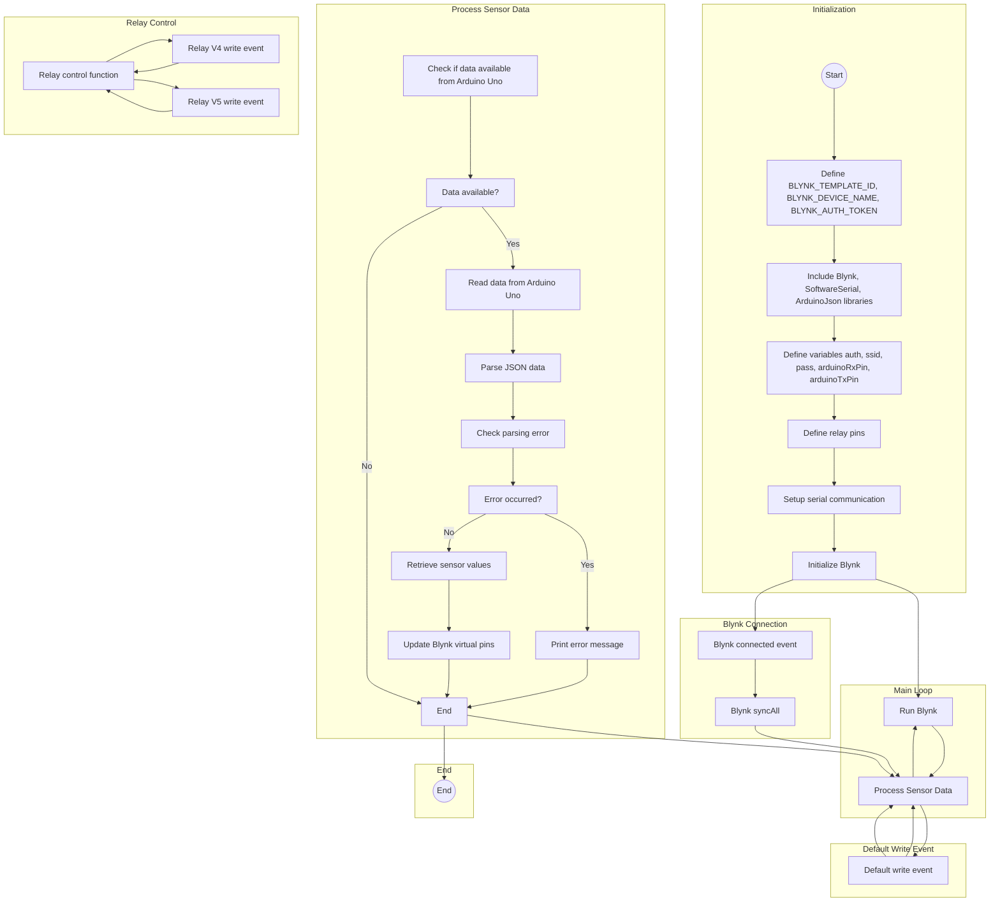

# Code2

This project allows you to monitor sensor data from an Arduino Uno using an ESP8266 board and display the data on the Blynk mobile app. The ESP8266 board acts as a bridge between the Arduino Uno and the Blynk server, enabling wireless communication.

The code provided establishes a connection with the Blynk server, reads JSON data sent by the Arduino Uno, and updates the sensor values on the Blynk app. It also includes relay control functionality to control external devices based on Blynk app inputs.

## Prerequisites

To use this code, you need the following components:

- ESP8266 board (e.g., NodeMCU)
- Arduino Uno
- Sensors compatible with the Arduino Uno (e.g., temperature, humidity, soil moisture, rain sensor)
- Blynk mobile app (available for iOS and Android)
- Arduino IDE

## Wiring

Connect the ESP8266 and Arduino Uno as follows:

- ESP8266 Tx pin (GPIO2) to Arduino Uno Rx pin
- ESP8266 Rx pin (GPIO3) to Arduino Uno Tx pin
- ESP8266 ground to Arduino Uno ground
- Connect the sensors to the appropriate pins on the Arduino Uno

## Installation

1. Install the Arduino IDE from the official website: https://www.arduino.cc/en/software

2. Open the Arduino IDE and install the required libraries:

   - Blynk Library: Sketch -> Include Library -> Manage Libraries. Search for "Blynk" and click the "Install" button.
   - ArduinoJson Library: Sketch -> Include Library -> Manage Libraries. Search for "ArduinoJson" and click the "Install" button.
   - SoftwareSerial Library: Sketch -> Include Library -> Manage Libraries. Search for "SoftwareSerial" and click the "Install" button.

3. Download or copy the provided code into a new sketch in the Arduino IDE.

4. Modify the code:

   - Replace `<your_template_id>` with the Blynk template ID.
   - Replace `<your_device_name>` with the desired device name.
   - Replace `<your_auth_token>` with the Blynk authentication token.
   - Replace `<your_wifi_ssid>` with your Wi-Fi network name (SSID).
   - Replace `<your_wifi_password>` with your Wi-Fi network password.

5. Upload the code to the ESP8266 board by selecting the board type and port in the Arduino IDE and clicking the "Upload" button.

6. Open the Blynk mobile app, create a new project, and associate it with the previously defined template ID.

7. Add the necessary widgets to the Blynk project to display the sensor data and control the relays (if needed).

8. Run the Blynk project on your mobile device.

9. Power on the Arduino Uno and ESP8266 board.

10. You should see the sensor data being displayed on the Blynk app, and you can control the relays through the corresponding widgets.

## Usage

1. Create a new project in the Blynk mobile app.
2. Set up the necessary widgets in the Blynk app:
   - Virtual pin V0: Temperature display
   - Virtual pin V1: Humidity display
   - Virtual pin V2: Soil moisture display
   - Virtual pin V3: Rain display
   - Virtual pin V4: Button/actuator control
3. Obtain the Blynk authorization token for your project.
4. Replace the `<your_template_id>`, `<your_device_name>`, `<your_auth_token>`, `<your_wifi_ssid>`, and `<your_wifi_password>` placeholders in the sketch with your actual information.
5. Upload the sketch to the ESP8266 board.
6. Power on the board and ensure it is connected to the Wi-Fi network.
7. Open the Blynk mobile app, log in, and navigate to your project.
8. The sensor data will be displayed on the corresponding virtual pins (V0 to V3).
9. Use the virtual pin V4 on the Blynk app to control the actuator (relay).

## Flowchart

## Customization

You can customize the sketch to fit your specific requirements:

- Modify the virtual pins and their corresponding widgets in the Blynk app to match your project setup.
- Extend the sketch to include additional sensors or actuators based on your project needs.
- If you have different pin assignments for the relay modules, modify the `RELAY_PIN` array in the code to match your configuration.
- Adjust the baud rate in the code (`9600` by default) if your Arduino Uno is using a different baud rate.

## Troubleshooting

If you encounter any issues or errors while running the code, make sure to double-check the following:

- Ensure that the Blynk template ID, device name, and authentication token are properly configured.
- Check your hardware connections and ensure they are wired correctly.
- If you encounter issues with serial communication, ensure that the connections between the ESP8266 and Arduino Uno are correct and secure.
- Double-check the Wi-Fi credentials (SSID and password) to ensure they are entered correctly.
- Verify that the Blynk authentication token is accurate and corresponds to your Blynk project.

If you're still facing issues, refer to the documentation of the libraries used or consult the Blynk community for further assistance.

## Contributing

Contributions to this project are welcome. If you have any suggestions, improvements, or bug fixes, please submit a pull request or open an issue on the GitHub repository.

## License

This project is licensed under the [MIT License](LICENSE). Feel free to use, modify, and distribute the code for personal or commercial purposes.

## Acknowledgments

- The sketch relies on the following libraries:
  - Blynk library: [https://github.com/blynkkk/blynk-library](https://github.com/blynkkk/blynk-library)
  - ArduinoJson library: [https://arduinojson.org/](https://arduinojson.org/)
- Thanks to the Blynk team for providing a powerful and user-friendly IoT platform.
