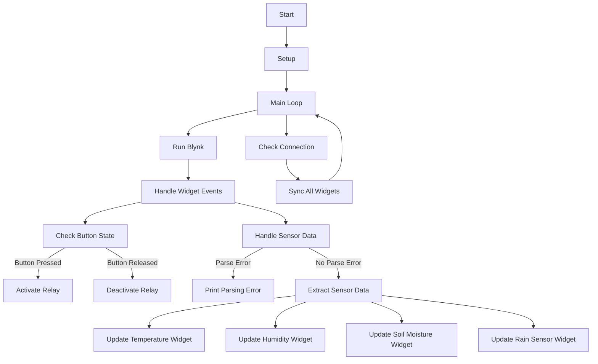

# Code2

This Arduino sketch enables you to monitor sensor data (temperature, humidity, soil moisture, and rain) using Blynk, an IoT platform, and control an actuator (relay) remotely. The sketch receives JSON data over the Blynk server and uploads the sensor values to specific virtual pins. The actuator control is replaced by a virtual pin on the Blynk app.

## Prerequisites

Before running the code, make sure you have the following:

- Blynk template ID: Replace `<your_template_id>` in the code with your Blynk template ID.
- Blynk device name: Replace `<your_device_name>` in the code with your Blynk device name.
- Blynk authentication token: Replace `<your_auth_token>` in the code with your Blynk authentication token.
- Wi-Fi credentials: Replace `<your_wifi_ssid>` and `<your_wifi_password>` in the code with your Wi-Fi network SSID and password, respectively.

Additionally, you will need the following components:

- ESP8266-based board (e.g., NodeMCU)
- Dual relay module
- Capacitive soil moisture sensor
- Analog rain sensor (resistance-based)
- DHT11 temperature and humidity sensor
- Push button (optional, replaced by virtual pin V4)
- Jumper wires
- Breadboard (optional)
- Blynk mobile app (iOS or Android)

Ensure that you have the required hardware components properly connected to the ESP8266 board before uploading the sketch.

## Installation

1. Install the Arduino IDE on your computer.
2. Connect the ESP8266 board to your computer using a USB cable.
3. Open the Arduino IDE and install the necessary libraries:
   - Blynk library
   - ArduinoJson library
4. Open the Arduino sketch file (`sensor_data_monitoring.ino`) in the Arduino IDE.
5. Customize the sketch by replacing the placeholders with your Blynk project information, Wi-Fi credentials, and relay control implementation.
6. Click on the "Upload" button to compile and upload the sketch to the ESP8266 board.

## Usage

1. Create a new project in the Blynk mobile app.
2. Set up the necessary widgets in the Blynk app:
   - Virtual pin V0: Temperature display
   - Virtual pin V1: Humidity display
   - Virtual pin V2: Soil moisture display
   - Virtual pin V3: Rain display
   - Virtual pin V4: Button/actuator control
3. Obtain the Blynk authorization token for your project.
4. Replace the `<your_template_id>`, `<your_device_name>`, `<your_auth_token>`, `<your_wifi_ssid>`, and `<your_wifi_password>` placeholders in the sketch with your actual information.
5. Upload the sketch to the ESP8266 board.
6. Power on the board and ensure it is connected to the Wi-Fi network.
7. Open the Blynk mobile app, log in, and navigate to your project.
8. The sensor data will be displayed on the corresponding virtual pins (V0 to V3).
9. Use the virtual pin V4 on the Blynk app to control the actuator (relay).

## Flowchart

## Customization

You can customize the sketch to fit your specific requirements:

- Modify the virtual pins and their corresponding widgets in the Blynk app to match your project setup.
- Replace the `activateRelay()` and `deactivateRelay()` functions with your own relay control implementation.
- Extend the sketch to include additional sensors or actuators based on your project

 needs.

## Troubleshooting

If you encounter any issues or errors while running the code, make sure to double-check the following:

- Verify that the Wi-Fi credentials (SSID and password) are correct.
- Ensure that the Blynk template ID, device name, and authentication token are properly configured.
- Check your hardware connections and ensure they are wired correctly.

If you're still facing issues, refer to the documentation of the libraries used or consult the Blynk community for further assistance.

## Contributing

Contributions to this project are welcome. If you have any suggestions, improvements, or bug fixes, please submit a pull request or open an issue on the GitHub repository.

## License

This project is licensed under the [MIT License](LICENSE). Feel free to use, modify, and distribute the code for personal or commercial purposes.

## Acknowledgments

- The sketch relies on the following libraries:
  - Blynk library: [https://github.com/blynkkk/blynk-library](https://github.com/blynkkk/blynk-library)
  - ArduinoJson library: [https://arduinojson.org/](https://arduinojson.org/)
- Thanks to the Blynk team for providing a powerful and user-friendly IoT platform.