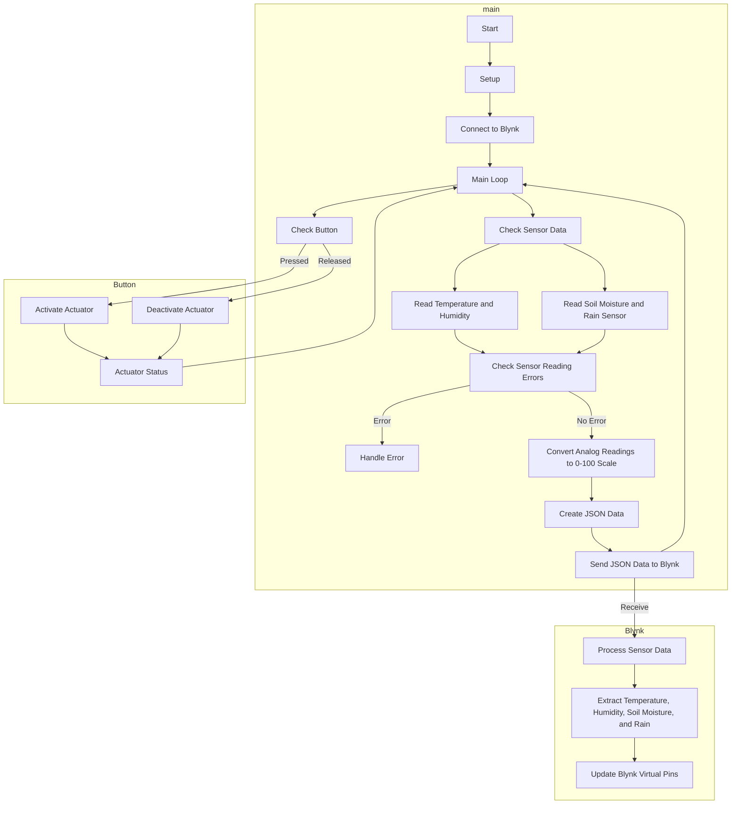

## Smart Irrigation System (Advance)

This Arduino sketch enables you to monitor sensor data (temperature, humidity, soil moisture, and rain) using Blynk, an IoT platform, and control an actuator (relay) remotely. The sketch receives JSON data over the Blynk server and uploads the sensor values to specific virtual pins. The actuator control is replaced by a virtual pin on the Blynk app.

### Prerequisites

- ESP8266-based board (e.g., NodeMCU)
- Dual relay module
- Capacitive soil moisture sensor
- Analog rain sensor (resistance-based)
- DHT11 temperature and humidity sensor
- Jumper wires
- Breadboard (optional)
- Blynk mobile app (iOS or Android)

### Installation

1. Install the Arduino IDE on your computer.
2. Connect the ESP8266 board to your computer using a USB cable.
3. Install the necessary libraries: Blynk library, ArduinoJson library.
4. Open the Arduino sketch file (`sensor_data_monitoring.ino`) in the Arduino IDE.
5. Customize the sketch by replacing the placeholders with your Blynk project information and Wi-Fi credentials.

### Usage

1. Create a new project in the Blynk mobile app.
2. Set up the necessary widgets in the Blynk app.
3. Obtain the Blynk authorization token for your project.
4. Replace the placeholders in the sketch with your actual information.
5. Upload the sketch to the ESP8266 board.
6. Power on the board and ensure it is connected to the Wi-Fi network.
7. Open the Blynk mobile app and navigate to your project.
8. Sensor data will be displayed on the corresponding virtual pins (V0 to V3).
9. Use virtual pin V4 on the Blynk app to control the actuator (relay).

### Flowchart

### Customization

- Modify virtual pins and widgets in the Blynk app to match your project setup.
- Replace the relay control functions with your own implementation.
- Extend the sketch to include additional sensors or actuators as needed.

For troubleshooting, refer to the Blynk documentation and community resources.
