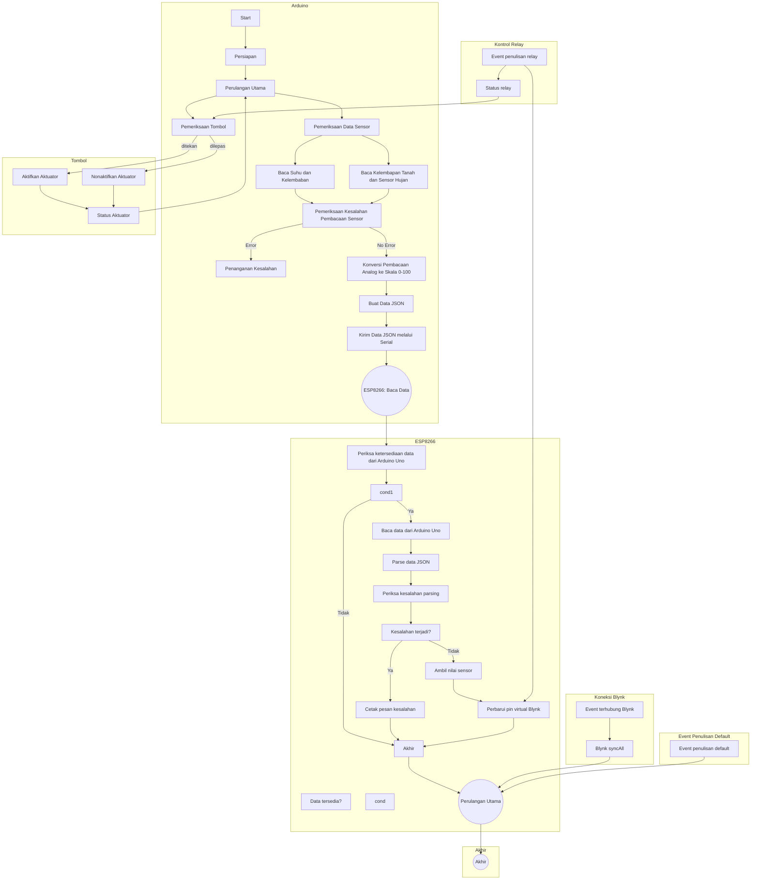

## Sistem Irigasi Cerdas (Lanjutan)

Sketch Arduino ini memungkinkan Anda untuk memonitor data sensor (suhu, kelembaban, kelembapan tanah, dan hujan) menggunakan Blynk, platform IoT, dan mengendalikan aktuator (relay) secara remote. Sketch ini menerima data JSON melalui server Blynk dan mengunggah nilai-nilai sensor ke pin virtual tertentu. Kontrol aktuator digantikan dengan pin virtual pada aplikasi Blynk.

### Persyaratan

- Papan berbasis ESP8266 (misalnya, NodeMCU)
- Papan berbasis AVR (misalnya, Arduino UNO)
- Modul relay ganda
- Sensor kelembapan tanah kapasitif
- Sensor hujan analog (berbasis resistansi)
- Sensor suhu dan kelembaban DHT11
- Kabel jumper
- Breadboard (opsional)
- Aplikasi mobile Blynk (iOS atau Android)

### Instalasi

untuk papan AVR:

1. Buka Arduino IDE di komputer Anda.
2. Hubungkan papan AVR ke komputer Anda menggunakan kabel USB.
3. Ikuti langkah-langkah [di sini](https://github.com/1999AZZAR/Smart-Irrigation-System/blob/master/code/advance/code1/readme_id.md).

untuk papan ESP8266:

1. Buka Arduino IDE di komputer Anda.
2. Hubungkan papan ESP8266 ke komputer Anda menggunakan kabel USB.
3. Ikuti langkah-langkah [di sini](https://github.com/1999AZZAR/Smart-Irrigation-System/blob/master/code/advance/code2/readme_id.md).

### Penggunaan

1. Buat proyek baru dalam aplikasi mobile Blynk.
2. Siapkan widget-widget yang diperlukan di aplikasi Blynk.
3. Dapatkan token otorisasi Blynk untuk proyek Anda.
4. Gantikan tempat-tempat kosong dalam sketch dengan informasi yang sebenarnya.
5. Unggah sketch ke papan ESP8266.
6. Nyalakan papan dan pastikan terhubung ke jaringan Wi-Fi.
7. Buka aplikasi mobile Blynk dan navigasikan ke proyek Anda.
8. Data sensor akan ditampilkan pada pin virtual yang sesuai (V0 hingga V3).
9. Gunakan pin virtual V4 pada aplikasi Blynk untuk mengendalikan aktuator (relay).

### Diagram Alir

### Penyesuaian

- Sesuaikan pin virtual dan widget di aplikasi Blynk sesuai dengan pengaturan proyek Anda.
- Gantikan fungsi kontrol relay dengan implementasi Anda sendiri.
- Perluas sketch untuk mencakup sensor atau aktuator tambahan yang dibutuhkan.

Untuk perbaikan masalah, lihat dokumentasi Blynk dan sumber daya komunitas.
