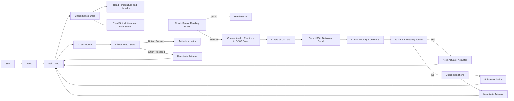

# Smart Irrigation System (standard)

This code implements a smart irrigation system using an Arduino board and various sensors. The system automatically controls the actuator to water plants based on predefined conditions such as temperature, humidity, soil moisture, and rain sensor readings. It also allows manual watering through a push button.

translation:

- [indonesian](https://github.com/1999AZZAR/Smart-Irrigation-System/blob/master/code/standard/readme_id.md)

## Hardware Requirements

- Arduino board
- DHT11 temperature and humidity sensor
- Soil moisture sensor
- Rain sensor
- Relay module
- Push button

## Software Dependencies

This code relies on the following libraries:

- DHT library: This library provides functions to read temperature and humidity from the DHT11 sensor.

Ensure that these libraries are properly installed in your Arduino IDE before uploading the code to the Arduino board.

## Pin Configuration

- DHT11 sensor: Connect the sensor data pin to digital pin 2 (DHTPIN).
- Soil moisture sensor: Connect the sensor output pin to analog pin A0 (soilMoisturePin).
- Rain sensor: Connect the sensor output pin to analog pin A1 (rainSensorPin).
- Relay module: Connect the relay control pin to digital pin 9 (relayPin).
- Push button: Connect one end of the button to digital pin 3 (buttonPin), and the other end to ground.

Please ensure that you have made the necessary hardware connections before running the code.

## Functionality

The code performs the following functions:

### Setup

- Initializes the serial communication at a baud rate of 9600.
- Configures the relay pin and button pin as output and input, respectively.
- Begins communication with the DHT11 sensor.

### Main Loop

- Checks the state of the push button using the `checkButton()` function.
- Checks the sensor data at regular intervals using the `checkSensors()` function.

### Sensor Data Checking

- Reads temperature, humidity, soil moisture, and rain sensor values.
- Checks for any errors in reading the sensor data.
- Creates a JSON string containing the sensor readings and sends it over the serial port.
- Calls the `checkWateringConditions()` function to determine if the actuator should be activated or deactivated.

### Push Button Checking

- Reads the state of the push button.
- If the button is pressed and manual watering is not active, activates the actuator.
- If the button is released and manual watering is active, deactivates the actuator.

### Watering Conditions Checking

- If manual watering is active, bypasses the conditions and keeps the actuator activated.
- Otherwise, checks the following conditions:
  - If the soil moisture is below 40 and no rain is detected, activates the actuator.
  - If the humidity is below 50 and the temperature is above 30, activates the actuator.
  - If the soil moisture is equal to or above 75 or rain is detected, deactivates the actuator.

### Actuator Control

- Activates the actuator by setting the relay pin to HIGH.
- Deactivates the actuator by setting the relay pin to LOW.
- Sends a message over the serial port indicating the activation or deactivation of the actuator.

## Usage

1. Make the necessary hardware connections as described in the "Pin Configuration" section.
2. Install the required libraries in your Arduino IDE.
3. Upload the code to your Arduino board.
4. Open the serial monitor in the Arduino IDE to view the sensor data and actuator status.

Ensure that the Arduino board is properly powered and connected to your computer.

## Flowchart

## Troubleshooting

- If you encounter any errors while reading the sensor data, check the connections and ensure that the sensors are functioning correctly.
- If the actuator is not activating or deactivating as expected, verify the relay module's connections and ensure that it

 is compatible with the actuator.

## Customization

You can customize the watering conditions by modifying the logic in the `checkWateringConditions()` function. Adjust the threshold values and conditions according to your specific requirements.

You can also modify the pin assignments and sensor types by changing the corresponding constants at the beginning of the code.

## Note

This code assumes the use of a DHT11 sensor for temperature and humidity, and analog sensors for soil moisture and rain detection. If you are using different sensors, make sure to modify the code accordingly and use the appropriate libraries and pin configurations.

This code is provided as a starting point and may require modifications and enhancements to suit your specific application and environment.

## License

This code is released under the [MIT License](https://opensource.org/licenses/MIT). Feel free to modify and use it for your projects.
