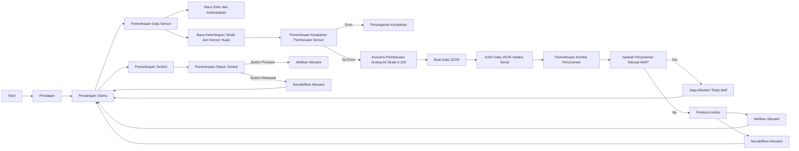

# Sistem Irigasi Pintar (standar)

Kode ini mengimplementasikan sistem irigasi pintar menggunakan papan Arduino dan berbagai sensor. Sistem ini secara otomatis mengontrol aktuator untuk menyiram tanaman berdasarkan kondisi yang telah ditentukan, seperti suhu, kelembaban, kelembapan tanah, dan pembacaan sensor hujan. Sistem ini juga memungkinkan penyiraman manual melalui tombol tekan.

## Persyaratan Hardware

- Papan Arduino
- Sensor suhu dan kelembaban DHT11
- Sensor kelembapan tanah
- Sensor hujan
- Modul relay
- Tombol tekan

## Ketergantungan Perangkat Lunak

Kode ini mengandalkan library-library berikut:

- Library DHT: Library ini menyediakan fungsi-fungsi untuk membaca suhu dan kelembaban dari sensor DHT11.

Pastikan library-library ini terinstal dengan benar di Arduino IDE sebelum mengunggah kode ke papan Arduino.

## Konfigurasi Pin

- Sensor DHT11: Hubungkan pin data sensor ke pin digital 2 (DHTPIN).
- Sensor kelembapan tanah: Hubungkan pin output sensor ke pin analog A0 (soilMoisturePin).
- Sensor hujan: Hubungkan pin output sensor ke pin analog A1 (rainSensorPin).
- Modul relay: Hubungkan pin kontrol relay ke pin digital 9 (relayPin).
- Tombol tekan: Hubungkan salah satu ujung tombol ke pin digital 3 (buttonPin), dan ujung lainnya ke ground.

Pastikan telah melakukan hubungan hardware yang diperlukan sebelum menjalankan kode.

## Fungsionalitas

Kode ini melakukan fungsi-fungsi berikut:

### Persiapan

- Menginisialisasi komunikasi serial dengan kecepatan baud 9600.
- Mengonfigurasi pin relay dan pin tombol sebagai output dan input, secara berturut-turut.
- Memulai komunikasi dengan sensor DHT11.

### Perulangan Utama

- Memeriksa status tombol tekan menggunakan fungsi `checkButton()`.
- Memeriksa data sensor pada interval tertentu menggunakan fungsi `checkSensors()`.

### Pemeriksaan Data Sensor

- Membaca nilai suhu, kelembaban, kelembapan tanah, dan sensor hujan.
- Memeriksa adanya kesalahan dalam membaca data sensor.
- Membuat string JSON yang berisi pembacaan sensor dan mengirimkannya melalui port serial.
- Memanggil fungsi `checkWateringConditions()` untuk menentukan apakah aktuator harus diaktifkan atau dinonaktifkan.

### Pemeriksaan Tombol Tekan

- Membaca status tombol tekan.
- Jika tombol ditekan dan penyiraman manual tidak aktif, mengaktifkan aktuator.
- Jika tombol dilepas dan penyiraman manual aktif, menonaktifkan aktuator.

### Pemeriksaan Kondisi Penyiraman

- Jika penyiraman manual aktif, melewati pemeriksaan kondisi dan tetap menjaga aktuator aktif.
- Jika tidak, memeriksa kondisi-kondisi berikut:
  - Jika kelembapan tanah di bawah

 40 dan tidak terdeteksi hujan, mengaktifkan aktuator.
  - Jika kelembaban di bawah 50 dan suhu di atas 30, mengaktifkan aktuator.
  - Jika kelembapan tanah sama dengan atau di atas 75 atau terdeteksi hujan, menonaktifkan aktuator.

### Kontrol Aktuator

- Mengaktifkan aktuator dengan mengatur pin relay menjadi HIGH.
- Menonaktifkan aktuator dengan mengatur pin relay menjadi LOW.
- Mengirim pesan melalui port serial yang menunjukkan aktivasi atau deaktivasi aktuator.

## Penggunaan

1. Hubungkan hardware yang diperlukan seperti yang dijelaskan pada bagian "Konfigurasi Pin".
2. Pasang library-library yang diperlukan di Arduino IDE.
3. Unggah kode ke papan Arduino Anda.
4. Buka monitor serial di Arduino IDE untuk melihat data sensor dan status aktuator.

Pastikan papan Arduino memiliki pasokan daya yang memadai dan terhubung dengan komputer Anda.

## Diagram Alir

## Troubleshooting

- Jika Anda mengalami kesalahan saat membaca data sensor, periksa koneksi dan pastikan sensor berfungsi dengan benar.
- Jika aktuator tidak mengaktifkan atau menonaktifkan seperti yang diharapkan, periksa koneksi modul relay dan pastikan kompatibel dengan aktuator.

## Penyesuaian

Anda dapat menyesuaikan kondisi penyiraman dengan mengubah logika dalam fungsi `checkWateringConditions()`. Sesuaikan nilai ambang batas dan kondisi-kondisi sesuai dengan kebutuhan spesifik Anda.

Anda juga dapat mengubah penugasan pin dan jenis sensor dengan mengubah konstanta-konstanta terkait di awal kode.

## Catatan

Kode ini mengasumsikan penggunaan sensor DHT11 untuk suhu dan kelembaban, serta sensor analog untuk kelembapan tanah dan deteksi hujan. Jika Anda menggunakan sensor yang berbeda, pastikan untuk memodifikasi kode secara ses

uai dan menggunakan library-library dan konfigurasi pin yang sesuai.

Kode ini disediakan sebagai titik awal dan mungkin memerlukan modifikasi dan penyempurnaan sesuai dengan aplikasi dan lingkungan spesifik Anda.

## Lisensi

Kode ini dirilis di bawah [Lisensi MIT](https://opensource.org/licenses/MIT). Anda bebas untuk memodifikasi dan menggunakannya untuk proyek Anda.
