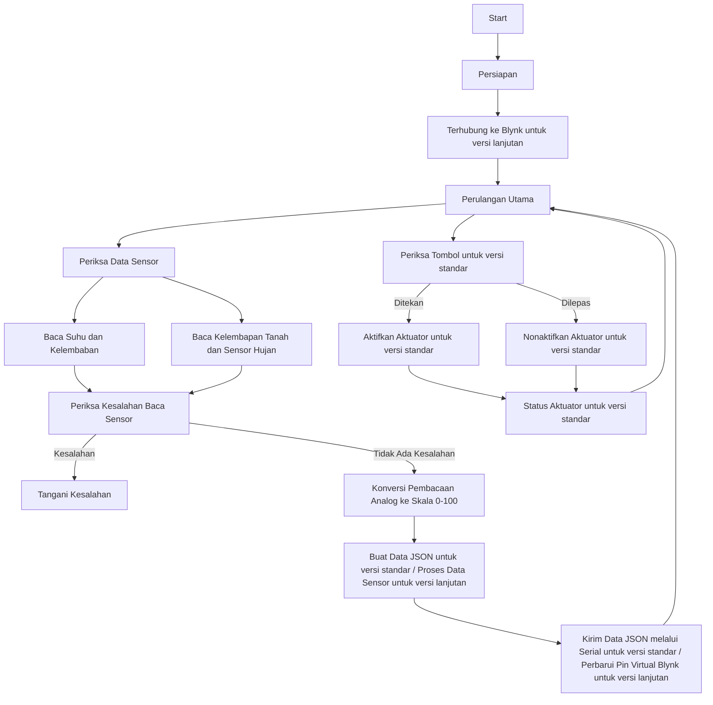

# Sistem Irigasi Cerdas

Kode ini mengimplementasikan sebuah sistem irigasi cerdas menggunakan papan Arduino dan berbagai sensor. Sistem ini secara otomatis mengontrol aktuator untuk menyiram tanaman berdasarkan kondisi yang telah ditentukan, seperti suhu, kelembaban, kelembapan tanah, dan pembacaan sensor hujan. Sistem juga memungkinkan penyiraman manual melalui tombol tekan dan menyediakan kontrol jarak jauh menggunakan platform IoT Blynk.

versi:
- [standar](https://github.com/1999AZZAR/Smart-Irrigation-System/blob/master/code/standard/readme_id.md)
- [lanjutan](https://github.com/1999AZZAR/Smart-Irrigation-System/blob/master/code/advance/readme_id.md)

## Persyaratan Hardware

- Papan Arduino
- Sensor suhu dan kelembaban DHT11
- Sensor kelembapan tanah
- Sensor hujan
- Modul relay (untuk versi standar)
- Modul relay ganda (untuk versi lanjutan)
- Tombol tekan (untuk versi standar)
- Papan berbasis ESP8266 (misalnya, NodeMCU) (untuk versi lanjutan)
- Kabel jumper
- Breadboard (opsional)

## Ketergantungan Perangkat Lunak

Kode ini bergantung pada library berikut:

- Library DHT: Library ini menyediakan fungsi untuk membaca suhu dan kelembaban dari sensor DHT11.
- Library Blynk (untuk versi lanjutan)
- Library ArduinoJson (untuk versi lanjutan)

Pastikan library-library ini terinstal dengan benar di Arduino IDE sebelum mengunggah kode ke papan Arduino.

## Konfigurasi Pin

Untuk versi standar:

- Sensor DHT11: Hubungkan pin data sensor ke pin digital 2 (DHTPIN).
- Sensor kelembapan tanah: Hubungkan pin output sensor ke pin analog A0 (soilMoisturePin).
- Sensor hujan: Hubungkan pin output sensor ke pin analog A1 (rainSensorPin).
- Modul relay: Hubungkan pin kontrol relay ke pin digital 9 (relayPin).
- Tombol tekan: Hubungkan satu ujung tombol ke pin digital 3 (buttonPin), dan ujung lainnya ke ground.

Untuk versi lanjutan:

- Sensor DHT11: Hubungkan pin data sensor ke pin digital 2 (DHTPIN).
- Sensor kelembapan tanah: Hubungkan pin output sensor ke pin analog A0 (soilMoisturePin).
- Sensor hujan: Hubungkan pin output sensor ke pin analog A1 (rainSensorPin).
- Modul relay ganda: Hubungkan pin kontrol relay ke pin digital 9 dan 10 (relay1Pin, relay2Pin).
- Papan berbasis ESP8266: Hubungkan papan ke komputer Anda menggunakan kabel USB.

Pastikan telah melakukan hubungan perangkat keras yang diperlukan sebelum menjalankan kode.

## Fungsionalitas

Kode ini melakukan fungsi-fungsi berikut:

### Persiapan

- Menginisialisasi komunikasi serial dengan baud rate 9600.
- Mengkonfigurasi pin relay dan pin tombol (untuk versi standar) sebagai output dan input, secara berurutan.
- Memulai komunikasi dengan sensor DHT11.
- Terhubung ke server Blynk (untuk versi lanjutan).

### Perulangan Utama

- Memeriksa status tombol tekan (untuk versi standar) menggunakan fungsi `check

Button()`.
- Memeriksa data sensor pada interval tertentu menggunakan fungsi `checkSensors()`.

### Pemeriksaan Data Sensor

- Membaca suhu, kelembaban, kelembapan tanah, dan nilai sensor hujan.
- Memeriksa adanya kesalahan dalam membaca data sensor.
- Membuat string JSON yang berisi bacaan sensor dan mengirimkannya melalui port serial (untuk versi standar).
- Mengirimkan data sensor ke server Blynk (untuk versi lanjutan).
- Memanggil fungsi `checkWateringConditions()` untuk menentukan apakah aktuator harus diaktifkan atau dinonaktifkan.

### Pemeriksaan Tombol Tekan (untuk versi standar)

- Membaca status tombol tekan.
- Jika tombol ditekan dan penyiraman manual tidak aktif, mengaktifkan aktuator.
- Jika tombol dilepas dan penyiraman manual aktif, menonaktifkan aktuator.

### Pemeriksaan Kondisi Penyiraman

- Jika penyiraman manual aktif, melewati pemeriksaan kondisi dan tetap mengaktifkan aktuator.
- Jika tidak, memeriksa kondisi-kondisi berikut:
  - Jika kelembapan tanah di bawah 40 dan tidak ada hujan terdeteksi, mengaktifkan aktuator.
  - Jika kelembaban di bawah 50 dan suhu di atas 30, mengaktifkan aktuator.
  - Jika kelembapan tanah sama dengan atau di atas 75 atau terdeteksi hujan, menonaktifkan aktuator.

### Kontrol Aktuator

- Mengaktifkan aktuator dengan mengatur pin relay menjadi HIGH (untuk versi standar).
- Menonaktifkan aktuator dengan mengatur pin relay menjadi LOW (untuk versi standar).
- Mengontrol aktuator menggunakan pin virtual V4 pada aplikasi Blynk (untuk versi lanjutan).
- Mengirimkan pesan melalui port serial (untuk versi standar) atau ke aplikasi Blynk (untuk versi lanjutan) yang mengindikasikan pengaktifan atau penonaktifan aktuator.

## Penggunaan

1. Hubungkan perangkat keras yang diperlukan seperti yang dijelaskan dalam bagian "Konfigurasi Pin".
2. Pasang library yang dibutuhkan di Arduino IDE Anda.
3. Unggah kode ke papan Arduino Anda.
4. Buka serial monitor di Arduino IDE untuk melihat data sensor dan status aktuator (untuk versi standar).
5. Siapkan widget yang diperlukan di aplikasi Blynk dan dapatkan token otorisasi Blynk (untuk versi lanjutan).
6. Gantikan placeholder dalam sketch dengan informasi yang sebenarnya (untuk versi lanjutan).
7. Unggah sketch ke papan ESP8266 (untuk versi lanjutan).
8. Nyalakan papan dan pastikan terhubung ke jaringan Wi-Fi (untuk versi lanjutan).
9. Buka aplikasi Blynk di ponsel dan navigasikan ke proyek Anda (untuk versi lanjutan).
10. Data sensor akan ditampilkan pada pin virtual yang sesuai (V0 hingga

 V3) (untuk versi lanjutan).
11. Gunakan pin virtual V4 di aplikasi Blynk untuk mengontrol aktuator (relay) secara jarak jauh (untuk versi lanjutan).

Pastikan papan Arduino (untuk versi standar) atau papan ESP8266 (untuk versi lanjutan) memiliki pasokan daya yang tepat dan terhubung dengan komputer Anda.

## Diagram Alir

## Troubleshooting

- Jika Anda mengalami kesalahan saat membaca data sensor, periksa hubungan dan pastikan sensor berfungsi dengan benar.
- Jika aktuator tidak mengaktifkan atau menonaktifkan sesuai yang diharapkan (untuk versi standar), periksa koneksi modul relay dan pastikan sesuai dengan aktuator.
- Untuk troubleshooting versi lanjutan, lihat dokumentasi Blynk dan sumber daya komunitas.

## Penyesuaian

Anda dapat menyesuaikan kondisi penyiraman dengan memodifikasi logika dalam fungsi `checkWateringConditions()`. Sesuaikan nilai ambang batas dan kondisi sesuai dengan kebutuhan spesifik Anda.

Anda juga dapat mengubah penugasan pin dan jenis sensor dengan mengubah konstanta-konstanta yang sesuai di awal kode.

Untuk versi lanjutan, Anda dapat memodifikasi pin virtual dan widget di aplikasi Blynk sesuai dengan pengaturan proyek Anda. Gantikan fungsi kontrol relay dengan implementasi Anda sendiri jika diperlukan. Perluas sketch untuk mencakup sensor atau aktuator tambahan sesuai kebutuhan.

## Catatan

Kode ini diasumsikan menggunakan sensor DHT11 untuk suhu dan kelembaban, dan sensor analog untuk kelembapan tanah dan deteksi hujan (untuk versi standar). Jika Anda menggunakan sensor yang berbeda, pastikan untuk memodifikasi kode sesuai dan menggunakan library dan konfigurasi pin yang sesuai.

Kode ini disediakan sebagai titik awal dan mungkin memerlukan modifikasi dan perbaikan untuk sesuai dengan aplikasi dan lingk

ungan spesifik Anda.
